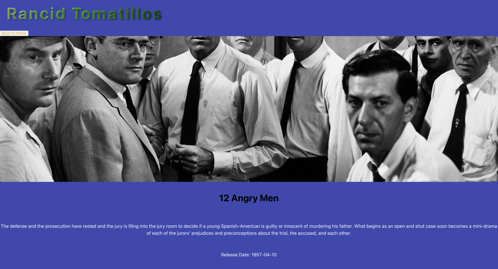

# Rancid Tomatillos - Starter Repo

## [The project spec for Rancid Tomatillos can be found here.](https://curriculum.turing.edu/module3/projects/rancid-tomatillos)

## Set Up
1. Project goals
   The goals of this project were begiining to understand react and how to connect an existing api to a react front end as well 
   as learning cypress testing framwork.

2. Challanges and Wins
   we had challenges with routing as well as connecting details into the application.

3. 

4. 
